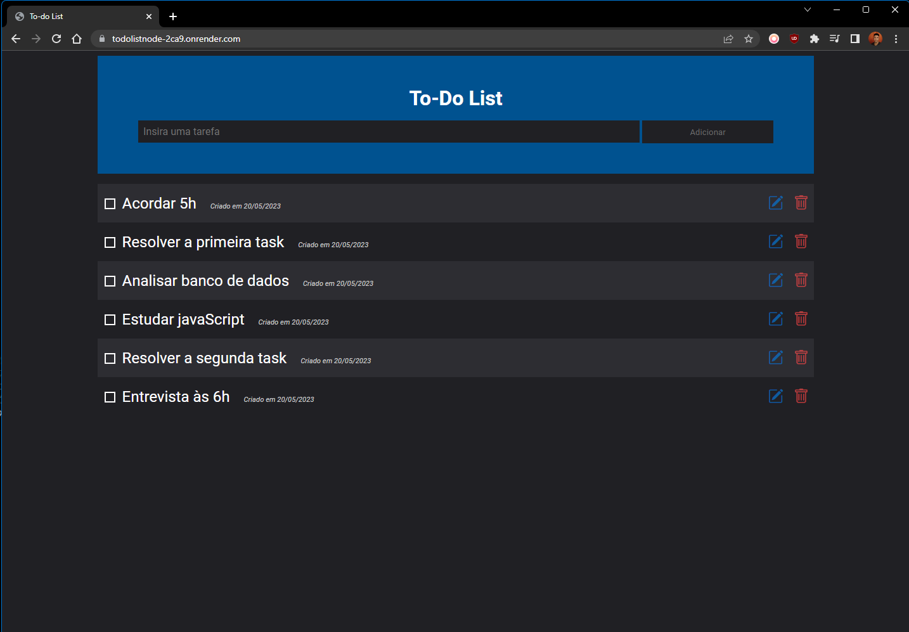

# To-DoListNode.js

## 1. Command to clone the repository
````
git clone https://github.com/ferreira-leonardo/To-DoListNode.js.git
````

## 2. Enter the project directory
````
cd To-DoListNode.js
````

## 3. Install all dependencies
````
npm install
````

## 4. Configure environment variables
Use the <a href='https://github.com/ferreira-leonardo/To-DoListNode.js/blob/main/.env.example'>🔗.env.example</a> file template to create your '.env' file and insert the necessary variables for the project to work

## 5. Running locally
````
npm start
````

## 6. Access the deploy
<a href='https://todolistnode-2ca9.onrender.com/'>🔗To-Do deploy</a>

## 7. Media

